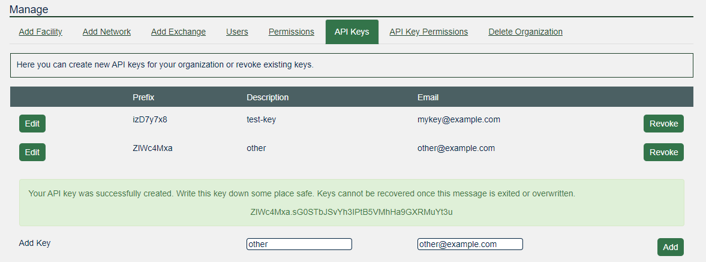
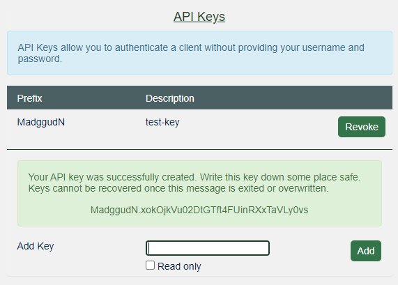

# API Keys

PeeringDB offers API keys for authenticating API requests. There are two main forms of API keys:

## Organization-level API Keys

These API keys are created and revoked from the organization admin panel. Each key gets its own custom permissions, which can be modified from the "org api key permissions" panel.

Each key must have an email attached to it; this is because keys may be allowed to create and modify data in PeeringDB, and we need a contact to reach out to in case of questions.  




## User-level API Keys

These API key are tied to a individual user account and can be created from the user profile page. There are only two permission levels: a normal key will mirror the same permissions of the user, while a readonly key will have readonly permissions to all the same namespaces as the user.



## Copy/Write down keys immediately

**One thing to note** is that the full api key string is only ever exposed to the user or organization at its moment of creation. If this string is lost, then the user or organization should revoke that key and create and permission a new one.


## Commandline example using Python and Requests
API keys allow developers to interact with their PeeringDB account programmatically, rather than through the website. Here is an example script in Python. It uses the module Requests to GET data about a particular Facility, and then sends a PUT request to modify that data.

This example assumes we have an environment variable set with our API Key. To do that from the commandline, we can run:

```sh
export API_KEY="[created api key string]"
```

Then the Python script would look like the following. First we get the API key from the environment:

```py
import os

import requests

API_KEY = os.environ.get("API_KEY")
```

We set the url for the Facility we want to interact with. Note the `/api` in the URL, which signals we are making calls to the REST API. 

```py
URL = "https://www.peeringdb.com/api/fac/10003"
```

We set the headers to include our API key as authorization. Printing the `headers` variable should allow us to see the API key.

```py
headers = {"AUTHORIZATION": "Api-Key " + API_KEY}
print(headers)
```

First we make a GET request, to simply get data about example Facility number 10003

```py
response = requests.get(URL, headers=headers)
data = response.json()["data"][0]
print(data)
```

Printing this data allows us to see what fields we would like to change. Let's say we decide to change the name of this facility. We overwrite the value for key "name"

```py
data["name"] = "Newly decided name"
```

Then we use a PUT request to send that modified data back to PeeringDB.
Note that this time, we must provide data to the API, using the keyword argument "data"

```py
put_response = requests.put(URL, headers=headers, data=data)
```

We can print the status code to see if our request was successful.

```py
print(put_response.status_code)
```
This will return a code 200 to signal success.

Additionally the content of the request should include data for the now modified Facility

```py
print(put_response.json())
```

Would return a dictionary of the values of the now modified Facility.

## Commandline example using Curl

API keys provide a cleaner way to authenticate api requests. PeeringDB recommends the commandline user creates a API_KEY variable like so

```sh
export API_KEY="[created api key string]"
```
then requests can be made with Curl like in the following examples:

### GET
The following request would return JSON data coresponding to the [ChiX](https://www.peeringdb.com/ix/239) Internet Exchange.

```sh
curl -H "Authorization: Api-Key $API_KEY" -H "Content-Type: application/json" -X GET https://peeringdb.com/api/ix/239 
```

### POST

The following request would create a new Network under the organization [United IX](https://www.peeringdb.com/org/10843). 

```sh
curl -H "Authorization: Api-Key $API_KEY" -H "Content-Type: application/json" -X POST --data "{\""org_id"\":\"10843\", \""name"\":\"Brand New Network\", \""asn"\":\"63311\"}" https://peeringdb.com/api/net
```

### PUT

The following request would update the data about a particular Network, [ChIX Route Servers](https://www.peeringdb.com/net/7889), in particular changing the name to "Edited Name".

```sh
curl -H "Authorization: Api-Key $API_KEY" -H "Content-Type: application/json" -X PUT --data "{\""org_id"\":\"10843\", \""name"\":\"Edited Name\", \""asn"\":\"33713\"}" https://peeringdb.com/api/net/7889
```

### DELETE
The following request would delete the [ChiX](https://www.peeringdb.com/ix/239) Internet Exchange. The API key holder would need delete privileges to that particular Exchange.

```sh
curl -H "Authorization: Api-Key $API_KEY" -H "Content-Type: application/json" -X DELETE https://peeringdb.com/api/ix/239
```
